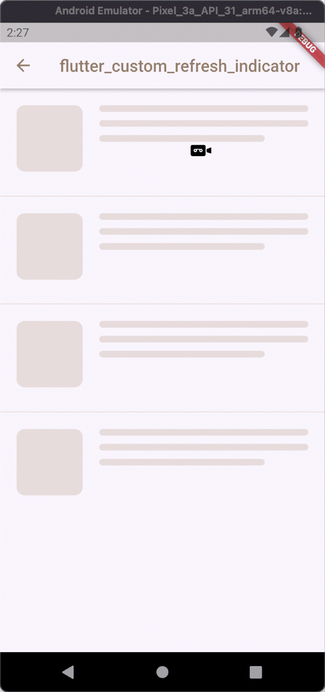
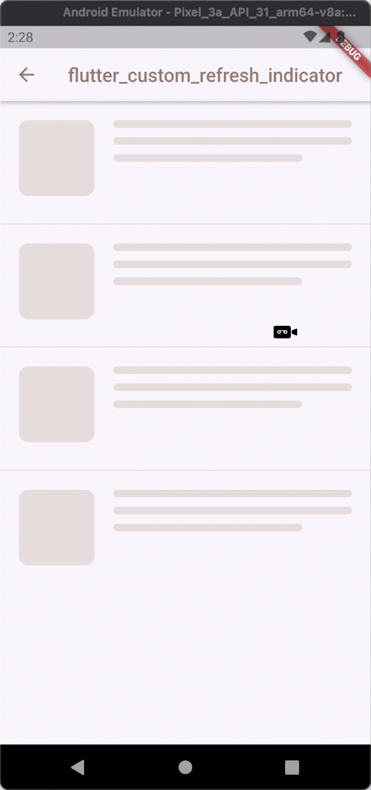
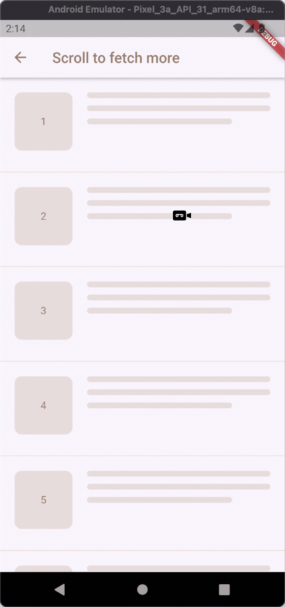

# Custom Refresh Indicator

[](https://github.com/gonuit/flutter-custom-refresh-indicator/actions/workflows/test.yml)

Create your own custom refresh indicator widget in the blink of an eye!

### Features:

- [Create a **COMPLETELY** custom refresh indicator widget.](#examples)
- [Quickly change the content of the material refresh indicator.](#custommaterialindicator)
- [Trigger refresh indicator on horizontal lists (online example).](https://custom-refresh-indicator.klyta.it/#/horizontal)
- [Trigger the refresh indicator from the leading, trailing, or both scroll edges.](#trigger-indicatortrigger)

### **TLDR; [ONLINE DEMO](https://custom-refresh-indicator.klyta.it/#)**!

---

## QUICK START

### **CustomMaterialIndicator**

If you just want to replace the content of the material indicator, you can use _CustomMaterialIndicator_ widget, which builds a material container. In addition to the built in _RefreshIndicator_ it supports horizontal lists and triggering from both edges (see the [trigger argument](#trigger-indicatortrigger)).


```dart
CustomMaterialIndicator(
  onRefresh: onRefresh, // Your refresh logic
  builder: (context, controller) {
    return Icon(
      Icons.ac_unit,
      color: Colors.blue,
      size: 30,
    );
  },
  child: scrollable,
)
```

### Effect:

<div align="center">
<a href="https://custom-refresh-indicator.klyta.it/#/presentation" target="_blank">

</a>
</div>


### **CustomRefreshIndicator**

Elevate your Flutter app with a tailor-made refresh indicator using the CustomRefreshIndicator widget. Just wrap your scrollable list, and design your unique indicator. It's that easy! 😏

```dart
CustomRefreshIndicator(
  onRefresh: onRefresh, // Your refresh logic
  builder: (context, child, controller) {
    // Place your custom indicator here.
    // Need inspiration? Look at the example app!
    return MyIndicator(
      child: child,
      controller: controller,
    );
  },
  child: ListView.builder(
    itemBuilder: (_, index) => Text('Item $index'),
  ),
)
```

### ~~Effect:~~ What's Possible?

Your creativity sets the boundaries! Explore our examples (just scroll a bit 👇) to see what you can build. From subtle animations to eye-catching visuals, make the refresh action a delightful moment. 🚀

# Examples

Almost all of these examples are available in the example application.

| Plane indicator [[SOURCE](example/lib/indicators/plane_indicator.dart)][[DEMO](https://custom-refresh-indicator.klyta.it/#/plane)] | Ice cream [[SOURCE](example/lib/indicators/ice_cream_indicator.dart)][[DEMO](https://custom-refresh-indicator.klyta.it/#/ice-cream)] | Warp [[SOURCE](example/lib/indicators/warp_indicator.dart)][[DEMO](https://custom-refresh-indicator.klyta.it/#/warp)] |
| :--------------------------------------------------------------------------------------------------------------------------------: | :----------------------------------------------------------------------------------------------------------------------------------: | :-------------------------------------------------------------------------------------------------------------------: |
|                                                                                      |                                                                                |                                                                           |

| With complete state [[SOURCE](example/lib/indicators/check_mark_indicator.dart)][[DEMO](https://custom-refresh-indicator.klyta.it/#/check-mark)] | Pull to fetch more [[SOURCE](example/lib/indicators/swipe_action.dart)][[DEMO](https://custom-refresh-indicator.klyta.it/#/fetch-more)] | Envelope [[SOURCE](example/lib/indicators/envelope_indicator.dart)][[DEMO](https://custom-refresh-indicator.klyta.it/#/envelope)] |
| :----------------------------------------------------------------------------------------------------------------------------------------------: | :-------------------------------------------------------------------------------------------------------------------------------------: | :-------------------------------------------------------------------------------------------------------------------------------: |
|                                                                        |                                                                                                     |                                                                               |

| Programmatically controlled [[SOURCE](example/lib/screens/programmatically_controlled_indicator_screen.dart)][[DEMO](https://custom-refresh-indicator.klyta.it/#/programmatically-controlled)] |                                                                 Your indicator                                                                  |                                                                 Your indicator                                                                  |
| :--------------------------------------------------------------------------------------------------------------------------------------------------------------------------------------------: | :---------------------------------------------------------------------------------------------------------------------------------------------: | :---------------------------------------------------------------------------------------------------------------------------------------------: |
|                                                                                                                          | Have you created a fancy refresh indicator? This place is for you. [Open PR](https://github.com/gonuit/flutter-custom-refresh-indicator/pulls). | Have you created a fancy refresh indicator? This place is for you. [Open PR](https://github.com/gonuit/flutter-custom-refresh-indicator/pulls). |

---

# Documentation

- [Usage](#usage)
- [CustomRefreshIndicator Parameters](#customrefreshindicator-parameters)
- [Indicator States](#indicator-states)
- [Handling State Changes](#handling-state-changes)
- [Trigger Modes](#trigger-modes)
- [IndicatorController Properties](#indicatorcontroller-properties)
- [IndicatorController Showcase](#indicatorcontroller-showcase)
- [Support](#support)

## Usage

Here is a quick example of how to use the CustomRefreshIndicator:

```dart
CustomRefreshIndicator(
  onRefresh: onRefresh,
  child: ListView(
    // Your ListView content here
  ),
  builder: (BuildContext context, Widget child, IndicatorController controller) {
    // Return your custom indicator widget here
  },
)
```

## CustomRefreshIndicator Parameters

### Basic

- **child (Widget)**: The content of the scroll view that will be pulled down to trigger the refresh.
- **builder (IndicatorBuilder)**: A function that returns the widget which will be used as the refresh indicator.
- **onRefresh (AsyncCallback)**: A callback when the refresh is initiated. Should return a Future.
- **controller (IndicatorController?)**: Manages the state and interaction of the refresh indicator.

### Timing and Durations

- **durations (RefreshIndicatorDurations)**
  - _cancelDuration_: Duration to hide the indicator after canceling.
  - _settleDuration_: Duration for the indicator to settle after release.
  - _finalizeDuration_: Duration to hide the indicator after refreshing.
  - _completeDuration_: Optional duration for the indicator to remain visible in the complete state after the _onRefresh_ action is completed. If not specified, the indicator will skip the _complete_ state and transition to the _finalizing_ state without remaining in the complete state.

### State Tracking

- **onStateChanged (OnStateChanged?)**: Callback that will be called when the state of the indicator changes.

### Customization

- **notificationPredicate (ScrollNotificationPredicate)**: Determines which _ScrollNotifications_ will trigger the indicator.
- **leadingScrollIndicatorVisible (bool)**: Visibility of the leading scroll indicator.
- **trailingScrollIndicatorVisible (bool)**: Visibility of the trailing scroll indicator.

### Trigger Behavior

- **offsetToArmed (double?)**: Pixel distance to trigger the refresh.
- **containerExtentPercentageToArmed (double?)**: Container extent percentage to arm the indicator.
- **trigger (IndicatorTrigger)**: Defines the edge from which the refresh can be triggered.
- **triggerMode (IndicatorTriggerMode)**: Configures the condition that will trigger the refresh.

### Performance

- **autoRebuild (bool)**: Whether to automatically rebuild the indicator on controller updates.

## Indicator States

CustomRefreshIndicator manages various states to provide feedback on the refresh process. Understanding these states will help you customize the behavior and appearance of your refresh indicator.

| State        | Value Range            | Description                                                                                   |
| ------------ | ---------------------- | --------------------------------------------------------------------------------------------- |
| `idle`       | `0.0`                  | The default state when no interaction is happening. The indicator is not visible.             |
| `dragging`   | `0.0` to `1.0`         | The user is pulling down, but hasn't yet reached the threshold to trigger a refresh.          |
| `armed`      | At or above `1.0`      | Pull-down has passed the threshold. Releasing now will trigger the _onRefresh_ callback.      |
| `canceling`  | Animates back to `0.0` | Pull-down stopped before the threshold; no refresh is triggered, and the indicator retracts.  |
| `loading`    | Steady at `1.0`        | The _onRefresh_ callback is active, indicating an ongoing refresh operation.                  |
| `complete`   | Steady at `1.0`        | Refresh is complete, and the indicator stays fully visible if _completeDuration_ is set.      |
| `finalizing` | `1.0` to `0.0`         | The refresh operation has finished, and the indicator is animating back to its initial state. |

Each state transition provides an opportunity to animate or adjust the UI accordingly, giving users a seamless and interactive experience.

## Handling State Changes

To react to state changes, you might set up an **onStateChanged** callback like so:

```dart
CustomRefreshIndicator(
  onRefresh: onRefresh,
  // Track state changes with the onStateChanged callback.
  onStateChanged: (IndicatorStateChange change) {
    // When transitioning from dragging to armed state, do something:
    if (change.didChange(from: IndicatorState.dragging, to: IndicatorState.armed)) {
      // Handle the armed state, e.g., play a sound, start an animation, etc.
    }
    // When returning to the idle state from any other state, do something else:
    else if (change.didChange(to: IndicatorState.idle)) {
      // Reset any animations, update UI elements, etc.
    }
    // Handle other state changes as needed...
  }
  // Additional properties...
)
```

This setup gives you the flexibility to customize the user's experience as they interact with the refresh indicator. For instance, you could start an animation when the state changes from dragging to armed, signaling to the user that their action will trigger a refresh.

## Trigger Modes

The _CustomRefreshIndicator_ widget provides flexible trigger modes that define how and where the pull-to-refresh gesture can be initiated within a scrollable list.

### trigger (IndicatorTrigger)

This property determines which edge of the list the pull-to-refresh can be initiated from. It is especially useful for lists that can be inverted using the _reverse_ argument.

| Value          | Description                                                                                                                                                                         |
| -------------- | ----------------------------------------------------------------------------------------------------------------------------------------------------------------------------------- |
| `leadingEdge`  | The pull-to-refresh gesture can only be initiated from the leading edge of the list. This is typically the top for standard lists, but it becomes the bottom when list is reversed. |
| `trailingEdge` | The pull-to-refresh can only be initiated from the trailing edge of the list. This is usually the bottom, but it switches to the top for lists that are reversed.                   |
| `bothEdges`    | The gesture can be triggered from both the leading and trailing edges of the list, allowing for pull-to-refresh functionality no matter which end the user starts dragging from.    |

### triggerMode (IndicatorTriggerMode)

This property controls how the _CustomRefreshIndicator_ can be activated in relation to the scrollable's position when the drag starts. It behaves similarly to the _triggerMode_ of the built-in _RefreshIndicator_ widget.

| Value      | Description                                                                                                   |
| ---------- | ------------------------------------------------------------------------------------------------------------- |
| `anywhere` | The refresh can be triggered from any position within the scrollable content, not just from the edge.         |
| `onEdge`   | The refresh will only be triggered if the scrollable content is at the edge when the dragging gesture begins. |

By default, _triggerMode_ is set to _onEdge_, which means that the refresh action is typically initiated when the user drags from the very top or bottom of the content, depending on the list orientation and the _trigger_ property settings.

These modes provide developers with control over the user's interaction with the refresh mechanism, ensuring a smooth and intuitive user experience that fits the context of the app's functionality.

## IndicatorController Properties

The _CustomRefreshIndicator_ widget is equipped with a controller that gives you access to the current state and behavior of the refresh indicator. Below is an in-depth look at the controller's properties.

### state (IndicatorState)

This property represents the current state of the indicator. It's a reflection of the user's interaction with the pull-to-refresh gesture, as well as the indicator's response to those interactions.

More information about the state can be found in the [Indicator States](#indicator-states) section.

### edge (IndicatorEdge?)

This property indicates from which end of the list the pull-to-refresh gesture was initiated.

| Value   | Description                                                           |
| ------- | --------------------------------------------------------------------- |
| `start` | The gesture started from the beginning of the list (usually the top). |
| `end`   | The gesture started from the end of the list (usually the bottom).    |

The _edge_ property is particularly useful when the _trigger_ is set to _bothEdges_, allowing the gesture to be recognized from either the start or end of the list.

### side (IndicatorSide)

The _side_ property determines on which side of the scrollable area the indicator "should" appear.

| Value    | Description                                                   |
| -------- | ------------------------------------------------------------- |
| `top`    | Places the indicator at the top of the scrollable content.    |
| `bottom` | Places the indicator at the bottom of the scrollable content. |
| `left`   | Places the indicator to the left of the scrollable content.   |
| `right`  | Places the indicator to the right of the scrollable content.  |
| `none`   | The indicator will not be displayed on any side.              |

### direction (AxisDirection)

This property identifies the axis direction along which the scrollable content moves. It can be _up_, _down_, _left_, or _right_.

### scrollingDirection (ScrollDirection)

This reflects the scrolling direction that the user is currently taking within the scrollable content. It helps in determining the appropriate response of the indicator to the user's scroll actions.

### dragDetails (DragUpdateDetails?)

This property provides the details about the drag update event, including the position and delta of the drag.

| Property         | Description                                                                                 |
| ---------------- | ------------------------------------------------------------------------------------------- |
| `globalPosition` | The global position of the pointer when the drag update occurred.                           |
| `delta`          | The delta distance the pointer has moved since the last update event.                       |
| `primaryDelta`   | The delta distance along the primary axis (e.g., vertical for a vertically scrolling list). |

The _dragDetails_ property is invaluable when you want to implement custom behavior based on the precise movement of the user's drag, allowing for fine-tuned control over the refresh indicator's response.

## IndicatorController Showcase

The `CustomRefreshIndicator` widget is designed to provide a flexible and responsive user experience. To better understand how the widget updates the controller's data in response to user interactions, an example is worth a thousand words.

Please visit the following live demo to see the _CustomRefreshIndicator_ in action: [Custom Refresh Indicator Live Example](https://custom-refresh-indicator.klyta.it/#/presentation).

<div align="center">
<a href="https://custom-refresh-indicator.klyta.it/#/presentation" target="_blank">

</a>
</div>

## Support

If you like this package, you have learned something from it, or you just don't know what to do with your money 😅 just buy me a cup of coffee ☕️ and this dose of caffeine will put a smile on my face which in turn will help me improve this package. Also as a thank you, you will be mentioned in this readme as a sponsor.

<div align="center">
<a href="https://www.buymeacoffee.com/kamilklyta" target="_blank"></a>
</div>
<p align="center">Have a nice day! 👋</p>
